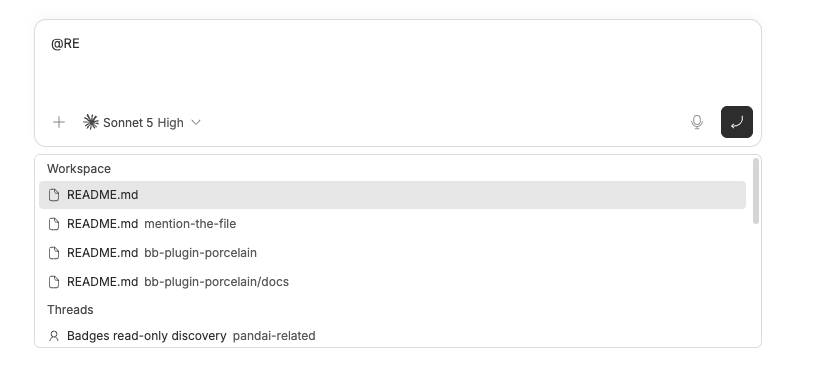

# bb-plugin-mention-the-file

A file/directory `@`-mention provider for [BB](https://getbb.app). Type `@`
in the composer — new thread, an existing thread, a queued message, or a
side chat — and search files and directories in that thread's workspace by
name. Picking a file attaches its contents to your message as agent-visible
(user-hidden) context; picking a directory attaches a listing of everything
under it. Either way, you don't have to paste it in or describe where it
lives.

Headless plugin: server-only, no frontend bundle, no settings.



## How it works

- **Trigger:** `@`, provider label **Files**.
- **Search** resolves the thread → its environment → the environment's
  `{ hostId, path }`, then runs a recursive fuzzy name search
  (`bb.sdk.files.listPaths`) rooted at the workspace, matching both files
  and directories, scoped to that host — so it works for threads on
  remote/enrolled machines too, not just the local one. Directories are
  shown with a trailing `/`.
- **Resolve** depends on what was picked:
  - **File** — reads it (`bb.sdk.files.read`) and returns its contents as
    the mention's context, wrapped in a fenced code block. Binary files
    resolve to a short note (path + size) instead of embedding content.
    Text content is capped at 200,000 characters; longer files are
    truncated with a trailing `(truncated)` marker rather than blocking the
    send.
  - **Directory** — lists everything under it (also via
    `bb.sdk.files.listPaths`, up to 500 entries) and returns that listing
    as the mention's context, one relative path per line, directories
    suffixed with `/`.
- No thread/environment attached to the composer yet (e.g. a brand new
  thread before it's created) → the provider returns no results rather than
  erroring.

## Install

```bash
bb plugin install git:github.com/WahidinAji/bb-plugins@main --plugin mention-the-file
```

Or locally via path:

```bash
bb plugin install --yes ./mention-the-file
```

## Develop

```bash
bb plugin install .      # register this directory
bb plugin dev            # rebuild + reload on save
bb plugin logs mention-the-file -f
```

## Architecture

| File          | Role                                                                 |
| ------------- | --------------------------------------------------------------------- |
| `server.ts`   | Registers the mention provider: `search` (fuzzy file/directory lookup scoped to the thread's environment) and `resolve` (reads a file, or lists a directory, into the attached context). |

The item id returned from `search` has no accompanying thread/project
context when `resolve` is later called, so it self-encodes everything
needed to read the entry back: `<kind>::<hostId>::<path>`, where `kind` is
`file` or `directory`.
